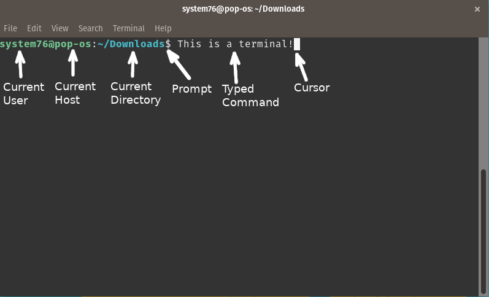

### Overview
	
Gives you an understanding of what a terminal is. Also walks you through the installation of this software and helps you customize the same so that you can execute the code that will be written.

### Learning Outcomes
- What is a terminal?

- How to install a terminal?

- How to customize the terminal?

- What are few basic commands to get started?

### Introduction
- What is a CLI and why do we need to use it
	- We communicate with modern computers by clicking, tapping, sliding, hovering, typing, shaking, and speaking. Through simple gestures, we are able to command the computer. Many computer operating systems such as Windows and OS X provide a graphical user interface that enables us to open and view files, play games, turn on music, etc., all by simple movements and clicks of the mouse. Most operating systems that run on servers, desktops, and laptops provide another way of commanding your computer that many people have never even heard of. It is aptly called the command line interface (or CLI), the command line, or the command prompt.
	- Like a graphical user interface, the command line is one way that the operating system represents the computer's files, directories, and programs (which are also files) to the user. In fact, the command line is a text-based interface through which one can navigate, create, execute, and act on a computer's files and directories with precision.

### What you must do
- Understand [what a terminal is & need for a terminal](https://dev.to/nrobinson2000/why-you-need-terminal-bpd)
- Understand [benefits that using a terminal provides you with](https://www.quora.com/Why-is-the-Command-Line-Terminal-used-in-programming)
- Understand [how to install terminal](https://helpdeskgeek.com/windows-10/how-to-install-use-the-new-windows-10-terminal) on your machine
- Understand [terminal for beginners](https://medium.com/@grace.m.nolan/terminal-for-beginners-e492ba10902a)
- Understand how to [customize the installed terminal](https://www.youtube.com/watch?v=sckbApgo4Fk)
- Understand [basic commands](https://www.thegeekstuff.com/2010/11/50-linux-commands/) to run in the terminal

### Additional Resources
- Further take a look at this video that explains [installing terminal](https://www.youtube.com/watch?v=4Rsr0NRHuBY) on your machine
