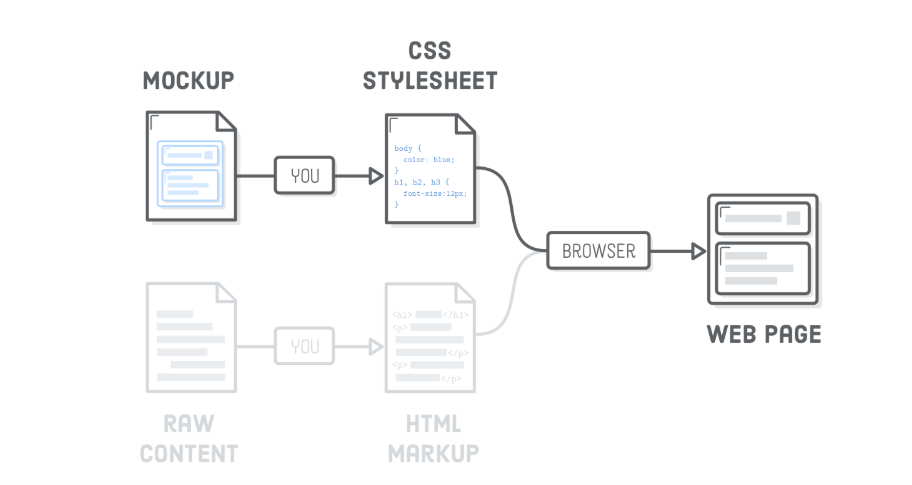

#### Overview

Begin your first step in learning CSS. In this topic, understand what it is and its role in a web page     

#### Learning Outcomes

- What is the role of CSS?

- What is a CSS Selector and its different types?

#### Introduction
After drilling down what HTML is, let's learn about Cascading Style Sheets (CSS). 

Where HTML represented the content of the web page, CSS defines how that content is presented to the user. It determines things like font size, margins, and colors using a language entirely separate from HTML.



*Source: [Interneting Is Hard](https://internetingishard.com/html-and-css/hello-css/)*


Web browsers apply CSS rules" to a document to affect how they it should look like. 

A CSS rule always start with a `"selector"` that defines which HTML elements it applies to. 

***
```css
body {
    color: #FF0000
}
```
***

In the above case, the `<body>` element is the "selector". After the selector, we have the declarations block . Any "properties"(in the above case, color is a property) we set in here will affect the `<body>` element.


#### What you must do

- Read a brief [introduction to CSS](https://www.yourhtmlsource.com/stylesheets/introduction.html). Complement that with looking and understanding [coded examples of CSS implementation](https://www.w3schools.com/whatis/whatis_css.asp)


- Learn and understand the [different types of CSS Selectors](https://www.sitepoint.com/css-selectors/) 


#### Additional References

- Go through a quick [reference guide on all CSS3 Selectors](https://htmldog.com/references/css/selectors/)

#### Quiz

1. 
```css
body {background-color= red}
```
The above code will result in:

a. Displaying red color in the background of web page

b. Syntax error 

2. Given the code:
```css
#class {
   width: 300px;
   margin: 0 auto;
}
```
The element class is a 

a. ID 

b. Class

3.
Given the code:
```css
.class {
   width: 300px;
   margin: 0 auto;
}
```
The element class is a 

a. ID

b. Class 

4. What is the correct cascading order for CSS stylesheets?

a.  Inline styles > External style sheet

b.  External style sheet > Inline styles  

