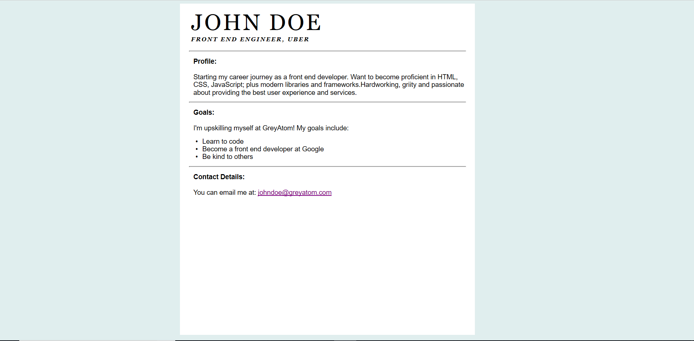
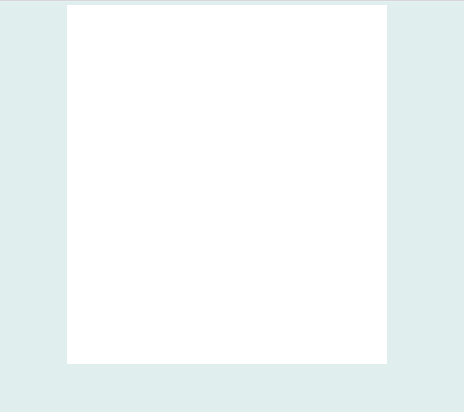

### Overview

Use the HTML and CSS foundations knowledge to create your own personal portfolio page mentioning your bio, goals and contact details

### Learning pre-requisites
Before starting this project make sure that you have completed learning following topics and solve the corresponding quizzes
- HTML basic structure
- HTML paragraphs
- HTML lists
- HTML links
- HTML headings
- CSS box model
- CSS units

### Web Page Mock Up
Following is the sample of how your final page should look like. Follow the step by step tasks in order to recreate the page shown below. We encourage you to add your own data instead of the dummy data used in the following screen.



**Note: This project will be evaluated. To understand how to go about it, kindly watch this [video walkthrough](https://vimeo.com/383940265/d48675eeed)**


### User Stories

#### User Story 1
As this is the first time you will be creating a full-fledged web page, we recommend you to set up your laptop with the IDE. You can use any IDE but we recommend you use [Visual Studio Code](https://code.visualstudio.com/) which is freely available. You can go through a quick setup guide available [here](https://code.visualstudio.com/docs/setup/setup-overview) for all operating systems.

#### User Story 2
Now that you have setup the IDE and ready to roll let us start building the web page.

Start a new project and create a new file `index.html` in the same.

Add the following HTML code to get started
```html
<!DOCTYPE html>
<html>
<head>
  <title></title>
</head>
<body>


</body>
</html>
```

Add your own title between the `<title>` tags

*The above code is the boilerplate code to be included everytime you create an HTML file for your website.*

Now, create a new file named `style.css` and add the following CSS code to the same to get started. 

```css
* {
    font-family: Helvetica, Arial, sans-serif;
    max-width: 700px;
    margin: auto;

  }

body {
      min-width: 500px;
      background-color: #e0eeee;
  }
```

*The above code will result in the following page view*


#### User Story 3

In the `<head>` section, link the CSS stylesheet to the HTML file

Use the link tag (`<link href="style.css" type="text/css" rel="stylesheet">`)

#### User Story 4
Create a `<div>` tag with class name as 'profileBody' in the HTML file
The add the following styling to the css file 
```css
.profileBody {
    display: inline-block;
    background-color: white;
    margin-top: 6px;
    margin-left: 55px;
    width: 75%;
    height: 590px;
  }

```
*Adding the above code should result in the following view:*



(Feel free to play around with the values)

#### User Story 5

Inside the `profileBody <div>`(for all consequent tasks, put everything inside it as well), use `<h1>` to write your name and `<h2>` to write your job title 

Add the CSS styling for this element of your choice

#### User Story 6

Add a horizontal break(`<hr />`)


#### User Story 7

Using `<p>`, write your bio profile. Remember to emphasise the 'Profile' heading using `<strong>`

Add the CSS styling for this element of your choice


#### User Story 8

Add a horizontal break(`<hr />`)

#### User Story 9

Using `<p>` & `<ul>`, write down your goals. Remember to emphasise the 'Goals' heading using `<strong>`

Add the CSS styling for this element of your choice

#### User Story 10

Add a horizontal break(`<hr />`)


#### User Story 11

Using `<p>` & `<a>`, write down your email contact info. Remember to emphasise the 'Contact Details' heading using `<strong>`

-------------------

The above tasks are the minimum expected of you. 

You are free to add as much personalization as you want in the portfolio page.

