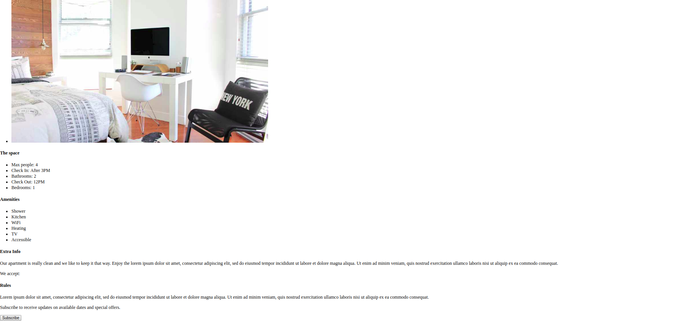

## Overview

In the last topic you learnt that how to add images on the page. This section will help you understand the concept of listing in HTML. Using list you can create amenities provided by the hotel, menu card is also created using the list. at the end of this concept you will be able to create this.

## Learning Outcome

- What are lists in HTML?
- What are ordered list?
- What are unordered list?

### HTML Lists

Lists are used to group together related pieces of information so they are clearly associated with each other and easy to read. In modern web development, lists are workhorse elements, frequently used for navigation as well as general content.

Lists are good from a structural point of view as they help create a well-structured, more accessible, easy-to-maintain document. They are also useful because they provide specialized elements to which you can attach CSS styles. Finally, semantically correct lists help visitors read your web site, and they simplify maintenance when your pages need to be updated.

### The three list types

There are three list types in HTML:

- **unordered list** — used to group a set of related items in no particular order
- **ordered list** — used to group a set of related items in a specific order
- **description list** — used to display name/value pairs such as terms and definitions

Each list type has a specific purpose and meaning in a web page.

#### What you must do?

- All the list types mentioned above has been covered extensively in the [post](https://www.geeksforgeeks.org/html-lists/)

### Additional References

This section contains some additional helpful links.

- A quick reference to [rendering list in HTML ](https://www.w3schools.com/html/html_lists.asp) which can come in handy while developing the site.

### Summary

In this topic, we learnt how to group and render different forms of list

Remember that list tags are block level elements. You are not restricted to use it just for bullet points. You can use it to render list of images or a group of articles. Any group of similar category can be rendered as lists.

### Assessment Quiz

1. An ordered list in HTML document starts with a

- `<ul> tag`
- `<ol> tag` [Answer]
- `<li> tag`
- `None`

2. From which tag descriptive list starts ?

- `<ll>`
- `<dd>`
- `<dl>` [Answer]
- `<ds>`

3. Which of the tag is used to creates a number list?

- `<li>`
- `<ol>`
- `<li> and <ol>` [Answer]
- `None of these`

4. Which tag creates a list with bullets?

- `<ol>`
- `<ul>` [Answer]
- `<dt>`
- `None of these`

5. Can you render the links in the unordered/ordered list?

- `Yes` [Answer]
- `No`
