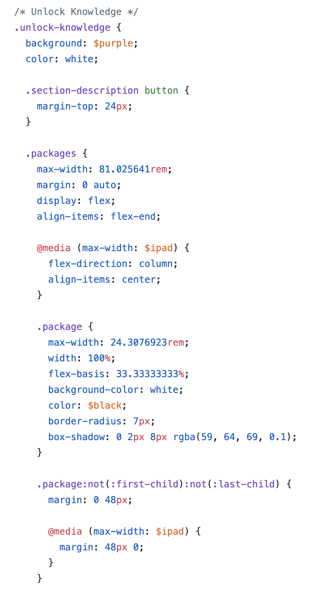
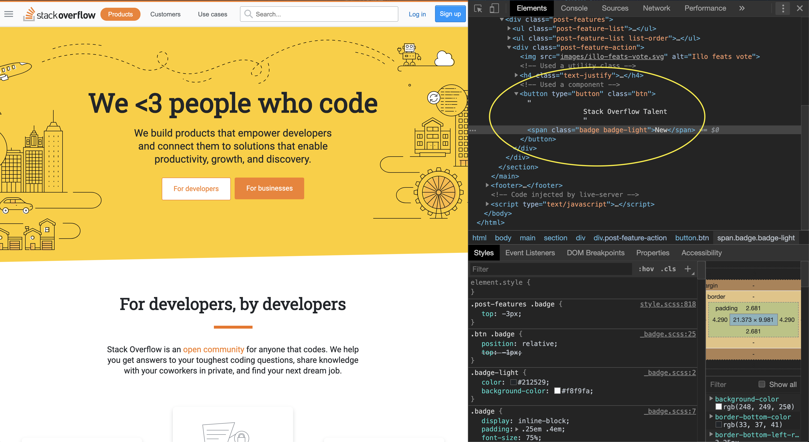

## What did you learn?

You should now be able to write CSS using SASS
At the end of this concept, you should have an understading of the advantages, features and uses of SASS. You have created sections of the StackOverflow landing page which we'll continue further along the course.

## Key take-aways

- You have a clear understanding of the advantages and usage of SASS.
- You know how to transpile SASS source code to css.
- You can create a responsive web page using SASS.
- You learnt the important features of SASS.
- You learnt how import SASS files.
- You learnt how to write mixins for reusability.

## How will it help the project?

You have learnt how to make the site responsive and add more power to css using SASS. You'd be styling the final project (Zomato Landing Page) by nesting the rules, use color variables to reuse and writing mixins for re-using responsive media queries with the power of SASS.

Next, you'd learn how to use Boostrap which is a popular framework developed by twitter to create a responsive website. Not only does it help you in making your site responsive, but also provides some utilities and components such as buttons, navigation, badge, etc. By the end of the unit, you should be able to achieve the UI shown in the below given image:

