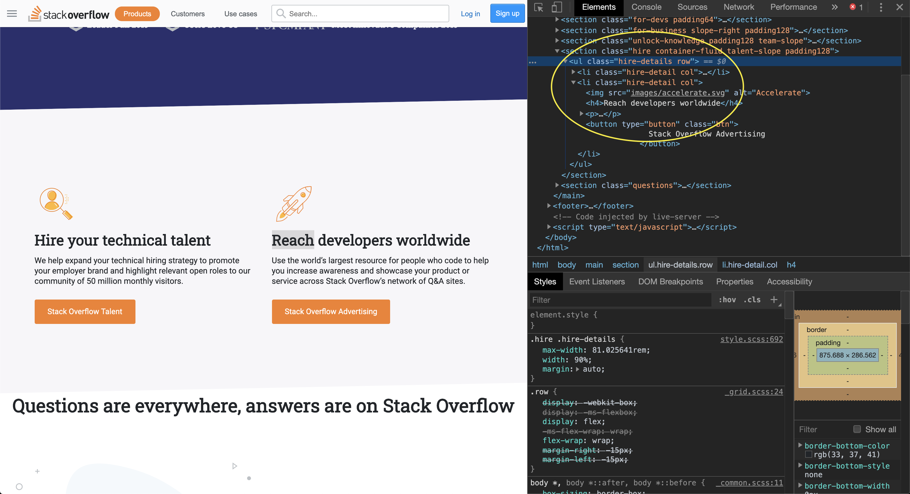

## Overview

In this section, we will learn about Bootstrap Layout and Content.

We'll be building parts of our Stack overflow site using the bootstrap grid layout system. It's completely fine to replace the default bootstrap css code for areas which cannot be just laid out with whatever bootstrap is providing. But, before you do so, you should always think if there is an alternative. Besides, it completely depends on the complexity of the design which will tell you if you can use bootstrap layout model to achieve designed layout. Not everything can be built with bootstrap alone.

You should be able to achieve something you see below:

## Learning Outcome

- How do set layout of a site in Bootstrap 4?
- How do you style your content in Bootstrap 4?

### Bootstrap Layout and Content

Bootstrap grid system provides the quick and convenient way to create responsive website layouts. The latest Bootstrap 4 version introduces the new mobile-first flexbox grid system that appropriately scales up to 12 columns as the device or viewport size increases.

Bootstrap 4 includes predefined grid classes for quickly making grid layouts for different types of devices like cell phones, tablets, laptops and desktops, etc. For example, you can use the `.col-*` classes to create grid columns for extra small devices mobile phones in portrait mode, similarly you can use the `.col-sm-*` classes to create grid columns for small screen devices like mobile phone in landscape mode, the `.col-md-*` classes for medium screen devices like tablets, the `.col-lg-*` classes for large devices like desktops, and the `.col-xl-*` classes for extra large desktop screens.

Bootstrap also helps in styling our site content such as images, typography, etc. and helps in making it reponsive.

#### What you must do?

- [Go through all the topics you see under Layout](https://getbootstrap.com/docs/4.0/layout/overview/). Bootstrap Grid system is one of core concepts of Bootstrap. Make sure you practice while you are learning it.
- [Go through all the topics under the content section](https://getbootstrap.com/docs/4.0/content/reboot/). This topic will guide you on how you can make the content (images, typography, etc) on your site responsive.

### Additional References

This section contains some additional helpful links.

- [A quick guide to the bootstrap 4 grid system](https://www.freecodecamp.org/news/learn-the-bootstrap-4-grid-system-in-10-minutes-e83bfae115da/)

### Summary

In this section, you learnt about laying out your website using Bootstrap grid system and styling your content as well as making it responsive using Bootstrap.

For some, Bootstrap Grid system can be a bit daunting and confusing but with time and practice you'd definitely master the system.

