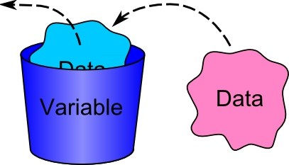

## Overview

This concept will help you understand about the basic building blocks of JavaScript i.e variables.

You'll be writing a program to remove duplicates from a list once we have covered all the topics to make your foundation of javascript concepts stronger.

For now, we expect that you'd be able to declare a variable and initialize it with a list of random numbers with duplicate entries after you are done with this concept.

## Learning Outcome

- What is a variable?
- What are the different types of variables?
- What are JS operators?

### Intro to JavaScript

JavaScript, not to be confused with Java, was created in 10 days in May 1995 by Brendan Eich, then working at Netscape and now of Mozilla. JavaScript was not always known as JavaScript: the original name was Mocha, a name chosen by Marc Andreessen, founder of Netscape. In September of 1995 the name was changed to LiveScript, then in December of the same year, upon receiving a trademark license from Sun, the name JavaScript was adopted. This was somewhat of a marketing move at the time, with Java being very popular around then.

#### What you must do?

- Read [what are the benefits of learning JavaScript?](https://boostlog.io/@sonuton/what-are-the-benefits-of-learning-javascript-5a87b3669837780090b3e833)

### Variables in JS

A JavaScript application works with information. Variables are used to store this information. Since there can be different kinds(text, number, etc) of information, there exists different types of variables in JS.

#### What you must do?

- A variable is a “named storage” for data. We can use variables to store goodies, visitors, and other data. Read how to [create variables](https://javascript.info/variables). Do solve the corresponding assignment.
- Read about the [different types of variable](https://javascript.info/types). Dive a little deeper into [string type variables](https://javascript.info/string). Do solve the corresponding assignment.
- Most of the time, operators and functions automatically convert the values given to them to the right type.For example, alert automatically converts any value to a string to show it. Mathematical operations convert values to numbers.There are also cases when we need to explicitly convert a value to the expected type. Read how to [convert variables from one type to another](https://javascript.info/type-conversions). Do solve the corresponding assignment.
- In this post, we will learn JavaScript’s variable scope and hoisting and all the idiosyncrasies of both.We must understand how variable scope and variable hoisting work in JavaScript, if want to understand JavaScript well. These concepts may seem straightforward; they are not. Some important subtleties exist that we must understand, if we want to thrive and excel as JavaScript developers. Read about [variable scope](http://javascriptissexy.com/javascript-variable-scope-and-hoisting-explained/).

### Operators in JS

Information stored in variables often involves operations. Operators are symbols or keywords that tell the JavaScript engine to perform some sort of actions on the variables.

#### What you must do?

- In this tutorial you will learn how to manipulate or perform the operations on variables and values using the operators in JavaScript.
  Read about all the [different operators](https://www.tutorialrepublic.com/javascript-tutorial/javascript-operators.php)

### Additional References

This section contains some additional helpful links.

-Let’s see what’s so special about JavaScript, what we can achieve with it, and which other technologies play well with it. Read why JavaScript has the unique position as the most [widely-adopted browser language](https://javascript.info/intro)

- This chapter discusses JavaScript's basic grammar, variable declarations, data types and literals. Dive deeper into the [JS Grammar](https://developer.mozilla.org/en-US/docs/Web/JavaScript/Guide/Grammar_and_Types)

