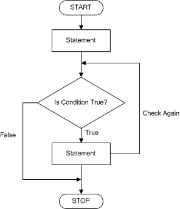

## Overview

This concept will help you understand the flow of control in JS programming and how to handle errors.

At the end, of this concept you should be able to control the flow of the program and catch errors. Declare a varibale and verify if it's undefined or has a value. If it's undefined, try throwing an error. Loop through the list of number you created in the previous section and try to log it in the console by using `console.log`. Read what `console.log` is used for.

## Learning Outcome

- What is a condition?
- What is looping?
- What are different methods of looping?
- Why do we need to loop?
- What is error handling?
- Why do we need to handle errors?

### Flow Of Control

Control flow or more appropriately phrased as flow of control is the order in which parts of a program are executed usually in response to the conditional statements such as `if` statements but may also include unconditional changes in flows for example, goto statements.

Typical flows are:

1. sequential in which statements are executed one after another
2. loops where certain processes are iterated
3. branches where flow is transferred based on an existing condition at time of execution.

#### What you must do?

- Sometimes, we need to perform different actions based on different conditions.To do that, we can use the if statement and the conditional operator ?, that’s also called a “question mark” operator. Read about [if..else condition](https://javascript.info/ifelse).
- A switch statement can replace multiple if checks.It gives a more descriptive way to compare a value with multiple variants. Read about the [switch statement](https://javascript.info/switch).
- We often need to repeat actions.For example, outputting goods from a list one after another or just running the same code for each number from 1 to 10.Loops are a way to repeat the same code multiple times. Try to understand [loops](https://javascript.info/while-for) in detail. The link is a complete guide to the native looping mechanisms available in JavaScript.
- Do solve the corresponding assignments in the link.

### Error handling in JS

No matter how great we are at programming, sometimes our scripts have errors. They may occur because of our mistakes, an unexpected user input, an erroneous server response and for a thousand other reasons.

Usually, a script “dies” (immediately stops) in case of an error, printing it to console.

But there’s a syntax construct `try..catch` that allows to “catch” errors and, instead of dying, do something more reasonable.

#### What you must do?

- JavaScript provides error-handling mechanism to catch runtime errors using try-catch-finally block, similar to other languages like Java or C#. Read about [how you can handle error in your JS program](https://www.tutorialsteacher.com/javascript/javascript-error-handling)

### Additional References

This section contains some additional helpful links.

- To understand the flow of control, visit [MDN: Control flow & error handling](https://developer.mozilla.org/en-US/docs/Web/JavaScript/Guide/Control_flow_and_error_handling), [MDN: Conditionals](https://developer.mozilla.org/en-US/docs/Learn/JavaScript/Building_blocks/conditionals) and [MDN: Loops_and_iteration](https://developer.mozilla.org/en-US/docs/Web/JavaScript/Guide/Loops_and_iteration) for quick reference.

