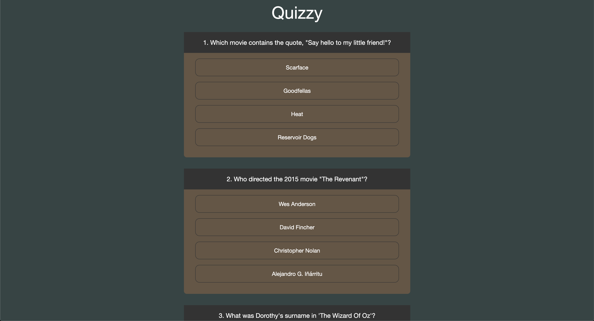

## What did you learn?

You should now have a better understanding of the advanced concepts of JavaScript.

At the end of this concept, you should able to complete the the quiz app rendering all the questions with options and allowing the user to submit the answers and showing them the count of the right answers.

## Key take-aways

- You have a clear understanding of commonly taught alogorithms related to stack and queue.
- You have learnt the advanced data struture concepts
- You have learnt about ES6, classes and inheritance
- You learnt about web storage
- You learnt about package managers

## Coding practice

In this assignment, we would convert the previously written code in JavaScript to be re-written in ES6.

## Your Tasks

### Task 1

Rewrite the code written in JavaScript to ES6. Try to use as many features as you can from ES6

### Task 2

Ask for the user name before you start the quiz. Create a Modal (Popup) with an input to accept the name of the user.

### Task 3

After user has answered all the questions, show him/her a message saying, ", you have answered <x (number)> answers correctly." where `Username` is the name you saved in the beginning and x is the number of answers the user answered correctly.

### Input

Use `aync await` for promises. Code rewrite and accept username

### Output

Rewrite the code in ES6 and show the result of quiz with a message that includes the username

### Constraints

- Promises should be handled using `async await` and `try..catch`
- Use jQuery for DOM manipulation

## How will it help the project?

Since, you have learnt about the newer version of JavaScript and package managers, try building the final project using ES6 and it's concept. Use package managers to install the libraries. We have provided you with the starter kit to begin.

Hope you enjoyed learning JavaScript as it's one of the most important and an essential scripting language for writing web applications. :)
