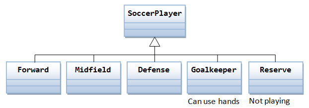

## Overview

This concept will help you understand Inheritance in JS and the infamous `this` keyword.

After covering this topic, you would be able to create classes and inherit properties and methods of other classes. Create a class `Vehicle`. The constructor accepts 3 parameters i.e make (e.g toyota), model (e.g corolla) and color (e.g black). Create a method called `getName` within the class. Calling this method would return the make, model and color of the vehicle.

Create another class that would inherit the properties of Vehicle class and add a method to `console.log()` the results of `getName`. Create a instance of the 2nd class and display results in the console.

## Learning Outcome

- How does Inheritance work in JS?
- What does the 'this' keyword do?

### Inheritance in JS

Inheritance is an important concept in object oriented programming. In the classical inheritance, methods from base class get copied into derived class.

In JavaScript, inheritance is supported by using prototype object. Some people call it "Prototypal Inheritance" and some people call it "Behaviour Delegation".



#### What you must do?

- Class inheritance is a way for one class to extend another class.
  So we can create new functionality on top of the existing. Go through the article to understand [JS inheritance](https://javascript.info/class-inheritance)

### 'this' keyword

Inheritance is an important concept in object oriented programming. In the classical inheritance, methods from base class get copied into derived class.

In JavaScript, inheritance is supported by using prototype object. Some people call it "Prototypal Inheritance" and some people call it "Behaviour Delegation".

#### What you must do?

- Understand [ the 'this' keyword in JS](https://www.w3schools.com/js/js_this.asp)
- You can definitely go through the complete article but focus particularly on the section titled ['this' in methods](https://javascript.info/object-methods)

### Additional References

This section contains some additional helpful links.

- The blog post on [Inheritance in JS](https://medium.com/hackernoon/inheritance-in-javascript-21d2b82ffa6f) covers prototypical inheritance in detail.
- After thoroughly understanding inheritance, you can take a look at [ES6 classes and inheritance](https://medium.com/ecmascript-2015/es6-classes-and-inheritance-607804080906)

### Assessment Quiz

1. The keyword or the property that you use to refer to an object through which they were invoked is \***\*\_\*\***

- `from`
- `to`
- `this` [Correct Answer]
- `object`

2. What will be the output of the following JavaScript code?

```js
var o = new F();
o.constructor === F;
```

- `false`
- `true` [Correct Answer]
- `0`
- `1`

3. When a class B can extend another class A, we say that?

- `A is the superclass and B is the subclass` [Correct Answer]
- `B is the superclass and A is the subclass`
- `Both A and B are the superclass`
- `Both A and B are the subclass`

4. If A is the superclass and B is the subclass, then subclass inheriting the superclass can be represented as \***\*\_\*\***

- `B=inherit(A);`
- `B=A.inherit();`
- `B.prototype=inherit(A);` [Correct Answer]
- `B.prototype=inherit(A.prototype);`
