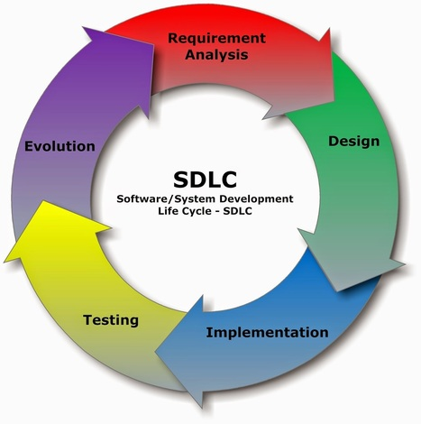

# Software Development Life Cycle

## Overview

In the previous topic, we touched upon the basic work flow that every web development process has to go through. This flow is a part of a bigger process that is followed by every software development team across the globe. 

This flow is called as the Software Development Life Cycle (SDLC) 
Learning this is an important step in understanding how to build an app in a timely and successfull way 

## Learning Outcome

-   What is SDLC?
- 	Why is SDLC so important for development?
- 	What are the different types of SDLC?
- 	What are the different processes involved in SDLC?

## Introduction

For every software(in our case, a web application) to be widely accepted by the consumers and clients alike, it's incredibly important to ensure its quality and efficiency. Software Development Life Cycle (or popularly known as SDLC) defines a set of steps that take the software from inception to completion. It entails all the tasks from planning, developing, testing, and deployment of software.
Based on the product and the team size involved, there are different methodologies or types of SDLC to be followed.

A typical SDLC consists of Requirement Analysis, Design, Implementation, Testing and Evolution

What you must do?

-  Understand about [various steps involved in SDLC](https://www.tutorialspoint.com/sdlc/sdlc_overview.htm) that you just read about. 

- Though the basic steps(Req. Analysis to Evolution) remain the same, lot of different implementations of these steps exist. Learn about the [different methodologies of SDLC.](https://melsatar.blog/2012/03/15/software-development-life-cycle-models-and-methodologies/). Pay special attention to the 'Agile Method', its one of the most preferred methodologies by web developers.

## Add more agile info

## Assessment Quiz

1.	Which of the following is the correct order of Software Development Life Cycle?

a.	Planning – Building – Deployment – Testing.

b.	Designing – Planning – Building – Deployment – Testing.

c.	Planning – Designing – Defining - Building – Testing – 
Deployment. [Correct answer]

d.	Building – Testing – Designing – Deployment – Testing.

2.	Which of the following SDLC models are well suited for small projects where requirements are clearly understood?

a.	Waterfall Model. [Correct answer]

b.	Spiral Model.

c.	Agile Model.

3.	Which of the following is NOT a process of Agile Methodology?

a.	The tasks are divided into small timeframes to deliver specific features.

b.	After every sprint, customer interaction is involved.

c.	No working software is produced until late in the life cycle. [Correct answer]

d.	Product requirements can change dynamically.

4.	Which of the following is a clear disadvantage of the V-shaped Methodology of SDLC?

a.	It is costly to implement the prototypes.

b.	It doesn’t provide a clear path for problems found during 
testing phases. [Correct answer]

c.	It requires heavy documentation.

d.	High cost and time to reach the final product.

5.	Which of the following SDLC method involves daily scrums?

a.	Spiral Model

b.	Waterfall Model

c.	V-shaped Model.

d.	Agile Model. [Correct answer]
