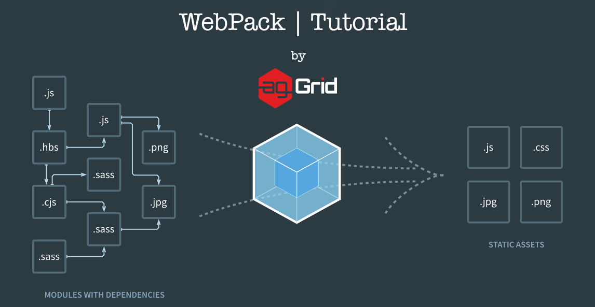

# Introduction to Webpack

## Overview

In this topic, we will be learning webpack which, essentially, is a code bundler. 

It’s extremely important for React developers and full-stack developers to have a good understanding of how to configure and use webpack.

## Learning Outcome

- What is webpack and how it aids in the process of deployment of web application?
- How is webpack configured?
- What is the difference between webpack and create-react-app?

## Introduction

Webpack takes the dependencies and generates a dependency graph allowing web developers to use a modular approach for their web application development purposes

## What you must do?

- Read and understand the [need for webpack configuration](https://medium.com/@kimberleycook/intro-to-webpack-1d035a47028d). The article also explains how a webpack configuration is created for a React application

- On the official website for webpack, the first graphical description simplifies the task of [understanding how webpack works.](https://webpack.js.org/) Furthermore, you can read the documentation to get a better understanding from the creator’s perspective.

- Read and understand the [difference between create-react-app and webpack](https://medium.com/@imbudhiraja/webpack-vs-create-react-app-cb72c47f8100)

## Additional resources
- Read and get a more [detailed insight into the world of React](https://www.smashingmagazine.com/2017/02/a-detailed-introduction-to-webpack/)
