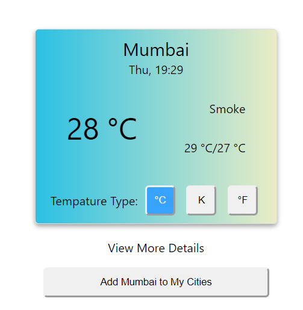

# The withRouter package

## Overview

In this session, we will learn about the withRouter package that comes with react-router-dom.


## Learning Outcome

You need to have a very good idea about the history, location and match props of react-router. If you still feel you are not so clear with the concepts, please read through the previous session once again.

You will learn the following in this session:

•	How to pass the router properties to deeply nested components?

•	What is withRouter and how to use it?

•	How to avoid passing router props all the way down to components?


## withRouter

You must have faced this problem before where you have a hierarchy of components and you have to pass certain props from a great-grandad component all the way down to the great-grandchild component. All the components in the middle serve as nothing but mere message passing agents. To simplify and optimize this, we learnt of a tool in the previous sprint.

Similarly, when you have to pass a router property to a component which is deeply nested inside, we need the help of something special to achieve that. This is where withRouter comes into the picture.

## What you must do?

•	Read [this article](https://hackernoon.com/withrouter-advanced-features-of-react-router-for-single-page-apps-42b2a1a0d315) to understand everything about withRouter.
•	Read the official documentation [here](https://reacttraining.com/react-router/core/api/withRouter) to understand more about this.

##  Coding Assignment

Continuing with our Weather Application, we will now add a detailed weather for every city feature in our application.

You need to do the following:

- In the card that is shown when you select a city, add another link called 'View more details' above the 'Add \<city-name> to My Cities' button.



- On clicking the view more details link, it should now be directed to another URL where we recreate the city card but with more details.

- Here, add the following information to the card using the data fetched from Open Weather API - ```Visbility, Wind Speed, Pressure, Humidity, Sunrise, and Sunset.```


- Use ```history, location, match, and withRouter``` to move from the home page to the detail page.

- Follow the styling of day and night on this page, as well.


If you are stuck in between, you can refer to the complete solution of the project [here](https://drive.google.com/file/d/1BiFcjVIviF3ZGB25ax00dAbd7PBjwpvb/view?usp=sharing)

