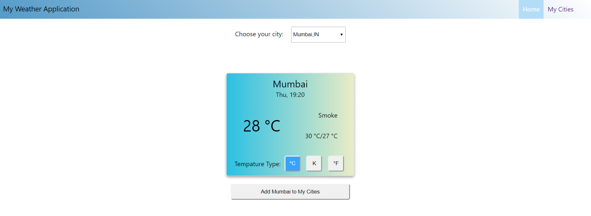

# Concept 5: Advanced React

## Introduction

The previous concept introduced you to the world of ReactJS – a world replete with reusable components, simplified coding and unbelievable rendering performances. In this concept, we will deep-dive into the advanced concepts of React. At the end of this sprint, you will be well-versed with concepts like refs, fragments, HOCs, error boundaries and much more. You will also learn how to achieve the feeling of a multi-page application in React using routing.

## Learning Objectives

In this sprint, we will be learning about some advanced concepts of React. To be able to comprehend these concepts, you need to have a complete understanding of the following topics:

•       What is ReactJS and how does it make web development more efficient?

•       What are components and what are the different types of components?

•       What are state and props in React?

•       How are events handled in React?

•       How to render lists in React? 

•       How to connect the React application to back-end?

•       What is create-react-app and how does it aid developers in coding?

If you are still not comfortable with these concepts, I would recommend you read through Sprint 4 again to understand these concepts before we move ahead.

At the end of this sprint, you will learn the following:

•	How to create React applications which can be used by every type of user, irrespective of the language spoken, machine, accessories or disability?

•	How to handle errors in React?

•	What are fragments and HOCs and how do they resolve the problem of not returning adjacent DOM element inside the render method in React?

•	How to pass components in a multi-level hierarchical React application?

•	How to make a stateless component use the properties of state and why is it needed?

•	How to dynamically style React components?

•	How to achieve routing within a React application?

## What will you be building?

- 'My Burger' Project

As part of coding assessment, you will also be modifying your 'Build my Burger' app using the new concepts you will learn in this sprint.

*Note: This assessment is added for learning purposes and therefore not formally evaluated*

If you are stuck in between, you can refer to the complete solution of the project [here](https://drive.google.com/file/d/1BiFcjVIviF3ZGB25ax00dAbd7PBjwpvb/view?usp=sharing)

# Update LINK

- 'Weather Application'

You will also be creating a new application - A Weather Application as part of your coding assessment

- 'Home' page

- 'My Cities' page

 

In this app, we will be using [Open Weather's](https://openweathermap.org/api) APIs for fetching the weather data for different cities **in India**.  We will also be saving the weather information and displaying weather information of cities of our choice.
 

If you are stuck in between, you can refer to the complete solution of the project [here](https://drive.google.com/file/d/1BiFcjVIviF3ZGB25ax00dAbd7PBjwpvb/view?usp=sharing)

# Update LINK

--

- Sprint Project: [Financial Portfolio Tracker](5.%20Project)

At the end of this sprint, you will be creating a work management app.It helps a software development team to keep track of the various tasks being handled during a sprint and the status of each task.

If you are not aware about Trello, it’s a team collaborative platform created by Atlassian.  For more information on Trello, visit this link: https://trello.com/

In the end-of-sprint project, you will be creating a replica of the Trello board.

By the end of the sprint, you should be able to build a Finance Portfolio Tracker with the following functionalities:

- Adding a stock(from the given list of companies)

- Viewing your stocks compared to the current price(Fetched by an API)

*Note: This project will be evaluated. To understand how to go about it, kindly watch this [video walkthrough](https://vimeo.com/383940265/d48675eeed)*
