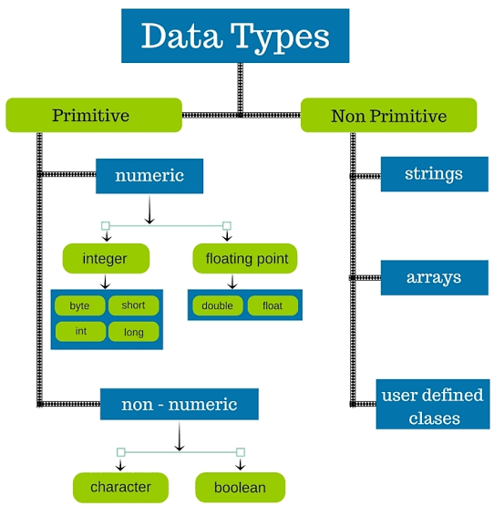

# Introduction to Data Types and Data Structures

## Overview

Before diving deeper into more complex concepts, this will serve as the basic building blocks and make further intuition more easy. The topic introduces the theory behind how the computer stores data and why is it important to organize it in structures.

It is important to have the foundations as any interviewer will have taken it for granted. Any ambiguity here may lead to confusion in further topics. Most interviewers test the coming concepts in great depth. 
## Learning Objectives

- What are data types and why are they required
- What are data structures
- What are the advantages in using data structures
- How are data structures and data types different

## What are Data Types

Information in a program is usually stored in variables. Each variable is assigned a particular address and space in the computers memory. However, each variable may not contain the same type of data. For example, one may store an <b>Integer</b>, another a <b>String</b>. And further operations on the variable may depend on this type.

A data type in a programming language is a set of data with predefined values. Examples of data types are: integer, floating point, unit number, character, string, etc

A high level classification of Data Types are:

-   <b>System Defined Data Types (Primitive)</b> 
      Data types that are defined by system are called primitive data types. The primitive data types
      provided by many programming languages are: int, float, char, double, bool, etc. The number of
      bits allocated for each primitive data type depends on the programming languages, the compiler
      and the operating system. However, across the same domain it remains constant. For example, the size of an Integer in Javascript is 8 bytes.

-   <b>Non Primitive Data Types </b> 
      When system defined types are inadequate, most languages provide support for user defined data types. For example, a collection/list of integers may be required for some function. This is called an Array.

The toxonomy can be seen below:

## What are Data Structures

Once we have data in variables, we need some mechanism for
manipulating that data to solve problems. Data structure is a particular way of storing and
organizing data in a computer so that it can be used efficiently. A data structure is a special
format for organizing and storing data. General data structure types include arrays, files, linked
lists, stacks, queues, trees, graphs and so on.

## What you must do

-   Read about the [Basics of Data Types and Variables in Javascript ](https://www.geeksforgeeks.org/variables-datatypes-javascript/)
-   Get and idea about the differences betweeen [Data Types and Data Structures](https://www.geeksforgeeks.org/difference-between-data-type-and-data-structure/)
-   Understand [why Data Structures so important](https://news.codecademy.com/why-data-structures/)

## Additional Resources

Refer to _Data Structures And Algorithms Made Easy: Data Structure And Algorithmic Puzzles_ by Narasimha Karumanchi
