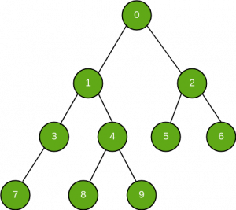
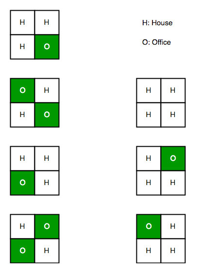

# Sprint 8 Coding Project

## Overview
Similar to sprint 7, the aprint 8 project consists of several competetive coding challenges that require a certain level of algorithmic thinking. You must submit the screenshot of the solution in the Google Form below.

## What you must do?

Solve the coding challenges given below as part of your sprint 8 project.
After solving them, you need to submit the screenshots of the solution

Understand [how to submit the solution screenshot](https://github.com/greyatom-school/the-minerva-project/blob/master/FEWD/sprint_7/Coding%20Assignment/Submit_Instructions.md)

## Trees
1. There is a folder on your Desktop. It has two other folders. Each of the two has two more. Assume that each folder is a node in a binary tree and the data in the node is the name of the folder. Write a program to find a particular folder given its name. 

<pre>
Input : 4
Output : YES
</pre>
2. In an organization, the CEO directs two people. Both those people directs two more forming a binary tree structre. Assuming that each employee is a node in a tree, find the max number of people needed for a CEO to issue an order to the employee at the lowest level. 

<pre>
Output : 3
</pre>

3. Find a pair with given sum in BST
Given a  BST and a sum, find if there is a pair with given sum. 

<pre>
Input : 33
Output : True
Explanation : As there exists a pair (25,8) that sums to 33, return true
</pre>
## Algorithms

4. Count ways to build street under given constraints 
There is a street of length n and as we know it has two sides. Therefore a total of 2 * n spots are available. In each of these spots either a house or an office can be built with following 2 restrictions:
	1. No two offices on the same side of the street can be adjacent.
	2. No two offices on different sides of the street can be exactly opposite to each other i.e. they can’t overlook each other.
	There are no restrictions on building houses and each spot must either have a house or office.
	Given length of the street n, find total number of ways to build the street.
 
<pre>
Input : 2
Output : 7
Please see below diagram for explanation.
</pre>

5. Minimum Number of Platforms Required for a Railway/Bus Station 
Given arrival and departure times of all trains that reach a railway station, the task is to find the minimum number of platforms required for the railway station so that no train waits.
We are given two arrays which represent arrival and departure times of trains that stop
<pre><code>
Input: arr[] = {9:00, 9:40, 9:50, 11:00, 15:00, 18:00}
dep[] = {9:10, 12:00, 11:20, 11:30, 19:00, 20:00}
Output: 3
There are at-most three trains at a time (time between 11:00 to 11:20) 
</code></pre>

## Strings

6. When hacking passwords, the most naive method is brute-forcing. Which means making random guesses till the write password is input. Hackers check for pressed keys on password screens to get the possible charecters. Write an efficient program to print all permutations of a given String to check for all possible password combinations.
<pre>
Input : ABC.
Output : ABC ACB BAC BCA CBA CAB
</pre>
7. Linguistic Researchers study languages. Some of their primary work focuses on analyzing the frequency of charecters in words. In fact, this research led to the design of the modern keyboard. Write an efficient program to return the maximum occurring character in the input string.
<pre>
Input : test
Output : t
</pre>

8. Build a function which checks the following password parameters:
	-   Password should contain uppercase and lowercase letters.
	-   Password should contain letters and numbers.
	-   Password should contain special characters.
	-   Minimum length of the password (the default value is 8).
<pre>
Input : gfg!@12
Output : Moderate
</pre>
 

## Submission

Upload the screenshots of the outputs as described in the "How to submit document" above in this [form](https://forms.gle/N9KBMvH9dhmLmzHg6)
