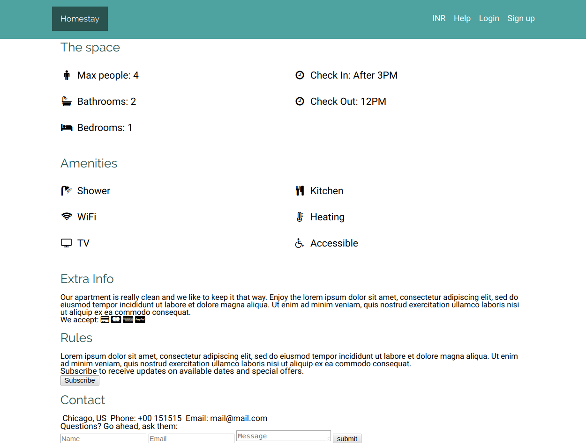

## Overview

In the previous section you have learnt about scrollbars, visisbility and idsplay. When it comes to building layouts and positioning content on a page there are a handful of different techniques to use. Which technique to use largely depends on the content and the goals of the page, as some techniques may be better than others.

This section will introduce you to CSS positioning for setting the layout. As the current apge is look like very simple we are going to do the proper partition of page so that web page looks wonderful for reading. After this concept you will be able to do this.

## Learning Outcome

- Why do we need to position elements?
- Which properties help in positioning the element?
- How and why do you let an element float on the page?

### CSS Layout and Positioning

 The ability to float elements side by side provides a nice, clean layout that is receptive to the different elements on a page. However, when more strict control is needed, elements may be positioned using other techniques, including `relative` or `absolute` positioning.

As per our experience, we strongly suggest you to not use the `float` property as there are better means to configure your layout and it becomes tedious to handle the positioning of such elements later on. But, do read about it thoroughly as legacy applications and some developers still use float. You might never know what projects you'd have to work with.

#### What you must do?

- Read about [the properties used for positioning and floating elements on the web page](https://www.htmldog.com/guides/css/intermediate/layout/). Do not skip the examples section to thoroughly understand all the concepts.
- In order to make more complex layouts, we need to discuss the position property. It has a bunch of possible values, and their names make no sense and are impossible to remember. Let's go through them one by one [A visual treat to understand positioning](https://learnlayout.com/position.html)

### Additional References

This section contains some additional helpful links.

- [Use the positioning playground to see how boxes are layed out when it's positioned based on the learnt property](https://www.bartbusschots.ie/pbsdemos/pbs8-PositioningPlayground/)
- [Another playground to learn positioning](http://www.mustbebuilt.co.uk/demo/css/position-playground.html)
- [A codepen playground to play with floats](https://codepen.io/GilDavid/full/WbYQPO)

### Summary

In this topic, we learnt about CSS layout and positioning.

As mentioned before, try to avoid using float. It's for educational purposes and it should only be used if some other developer has used it and it's very tricky to replace his/her code.

Positioning is usually used for stacking e.g. I want to show an image on top of another. It would not necessarily used for the same. You can also override an existing element that has been positioned with an another value of the `position` property

### Assessment Quiz

1. Select the most appropriate CSS declaration to position a `
` element so that other elements that follow after it may occupy space to the right of it.

- `float: none;`
- `position: right;`
- `position: left;`
- `float: left;` [Answer]

2. When the CSS declaration `clear: both;` is applied to an element, it will appear below any floating elements above.

- `False`
- `True` [Answer]

3. You can apply a specially written class of `clearfix` to parents with floating children to prevent the parents from collapsing.

- `True` [Answer]
- `False`

4. Select the most appropriate CSS declaration(s) to set an element to `absolute` positioning in the top right corner.

- `position: top right;`
- `position: absolute; top: 0; right: 0;` [Answer]
- `position: absolute; top: 0; left: 0;`
- `None of the above`

5. Fill in the blank: **\_\_\_\_** positioning makes an element appear in the same place relative to the browser window even when scrolling occurs.

- `absolute`
- `fixed` [Answer]
- `static`
- `relative`
